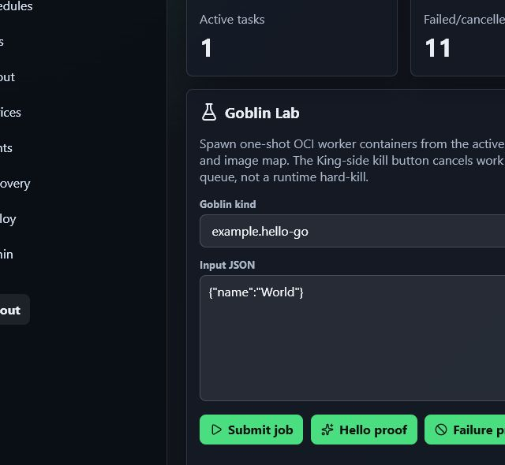
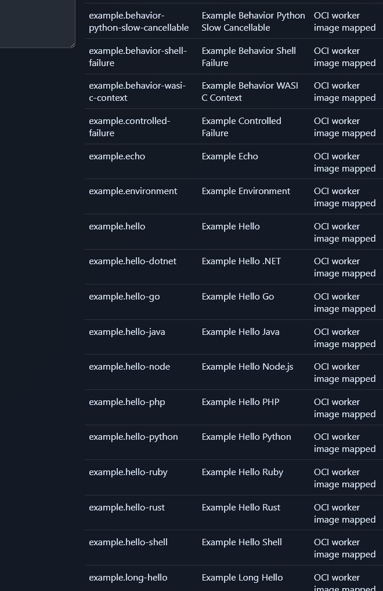

# Goblin King

Goblin King is a reusable scheduler and control plane for running small, isolated worker
containers called goblins. Goblins run as self-contained Docker/OCI workers, which lets
each worker use the language and runtime that fits its job while the King keeps
scheduling, status, and result contracts consistent.

Use Goblin King when you want a project to define small jobs, run them in isolated
containers, inspect what happened, and keep a durable audit trail. Docker and Compose
are the default local path. Kubernetes is optional through the Helm chart when a project
needs a cluster deployment.

**Status: Open-source alpha / project-adoptable alpha.** Goblin King is ready
for trusted self-hosted projects that want to define, validate, schedule, and
inspect their own contract-compliant Docker task containers. It is not intended
for untrusted third-party container execution, public multi-tenant workloads, or
production deployments without additional hardening.

Goblin King can be used by trusted self-hosted projects as a local/project
scheduler for contract-compliant Docker task containers. Adopters can run the
local/dev stack and use the admin panel to validate, submit, and inspect their
own project goblins. This remains project-adoptable alpha software and is not
intended for untrusted third-party container execution.

## Table Of Contents

- [Goblin King](#goblin-king)
- [Table Of Contents](#table-of-contents)
- [Quick Start](#quick-start)
- [Clean Restarts](#clean-restarts)
- [Using Goblin King In Your Project](#using-goblin-king-in-your-project)
- [Goblin Container Contract](#goblin-container-contract)
  - [Launch Language Goblins In Admin](#launch-language-goblins-in-admin)
- [Worker Images](#worker-images)
- [Admin Runtime Audit](#admin-runtime-audit)
- [Resource Policies](#resource-policies)
- [Image Promotion And Deployment Proof](#image-promotion-and-deployment-proof)
- [Capabilities](#capabilities)
- [Documentation](#documentation)
- Deeper manuals:
  - [User Guide](docs/USER_GUIDE.md)
  - [Admin Guide](docs/ADMIN_GUIDE.md)
  - [Goblin Container Contract](docs/goblin-container-contract.md)
  - [What Is A Goblin?](docs/what-is-a-goblin.md)
  - [Writing Goblins](docs/writing-goblins.md)
  - [Goblin Dockerfiles](docs/goblin-dockerfiles.md)
  - [Language-Agnostic Workers](docs/language-agnostic-workers.md)
  - [Security Policy](SECURITY.md)
  - [Security Model](docs/security-model.md)
  - [API Roadmap](docs/api-roadmap.md)
  - [Scheduler Plan](docs/goblin-king-plan.md)
  - [Adopting Projects](docs/ADOPTING_PROJECTS.md)
  - [Adopter Guide](docs/adopter-guide.md)
  - [Public API Boundary](docs/PUBLIC_API.md)
  - [Release Checklist](docs/RELEASE_CHECKLIST.md)
  - [Production Roadmap Closeout](docs/ROADMAP_CLOSEOUT.md)
  - [Code Cleanup Notes](docs/CODE_CLEANUP.md)
  - [Contributing](CONTRIBUTING.md)

## Quick Start

Install the package for local development:

```bash
python -m pip install -e .[dev]
```

Run the local CI checks:

```bash
python -m pytest
python -m ruff check .
```

Build worker images and start Redis:

```bash
make deploy
```

Create and run a due schedule through Docker:

```bash
goblin-king schedules add example.echo --cron "* * * * *" --input examples/input.json --registry demo-goblins.json --due-now
goblin-king scheduler run-once --registry demo-goblins.json --images demo-images.json --redis-url redis://localhost:6379/0
goblin-king jobs list
```

Or run the local simulation target:

```bash
make simulate
```

Run the API locally:

```bash
goblin-king api run --settings goblin-king-api.json
```

Smoke the API from another terminal:

```bash
curl http://127.0.0.1:8000/health
curl -H "Authorization: Bearer local-dev-token" http://127.0.0.1:8000/goblins
curl -X POST http://127.0.0.1:8000/jobs \
  -H "Authorization: Bearer local-dev-token" \
  -H "Content-Type: application/json" \
  -d "{\"kind\":\"example.echo\",\"input\":{\"message\":\"hello api\"}}"
```

Create local API principals and scoped tokens:

```bash
goblin-king auth create-user --email dev@example.test --display-name Dev
goblin-king auth create-project --name "Local Project"
goblin-king auth create-token --name local-token --user-id <user-id> --project-id <project-id>
```

Only `GET /health` is open. Other HTTP endpoints and `WS /ws/runs` require bearer
tokens. API list endpoints return paginated envelopes such as:

```bash
curl -H "Authorization: Bearer local-dev-token" "http://127.0.0.1:8000/jobs?limit=20&offset=0"
```

For external identity, enable OIDC/JWT validation in `goblin-king-api.json`. Local API
tokens are checked first; if no local token matches, Goblin King validates the bearer
token against the configured issuer, audience, and JWKS URL, then maps configured role
and project claims into the same RBAC model:

```json
{
  "oidc": {
    "enabled": true,
    "issuer": "https://issuer.example",
    "audience": "goblin-king",
    "jwks_url": "https://issuer.example/.well-known/jwks.json",
    "role_claim": "goblin_king_role",
    "project_claim": "goblin_king_project_id"
  }
}
```

OpenAPI metadata is available at `/openapi.json` with bearer auth schemes, stable
operation IDs, response models, and error response shapes for generated clients.

Use `--runtime in-process` on `jobs submit`, `scheduler run-once`, or `scheduler run`
when debugging trusted local Python goblins without Docker. In-process execution is a
developer convenience; the worker model is the container contract.

The current adopter contract is `goblin-king/v1alpha1`. Worker containers receive that
value as `GOBLIN_CONTRACT_VERSION`, project config files declare it as
`apiVersion: goblin-king/v1alpha1`, and the public import boundary is documented in
[`docs/PUBLIC_API.md`](docs/PUBLIC_API.md).

Create a reusable goblin package skeleton:

```bash
goblin-king project init-package ./my-goblin --kind my.echo --package-name my_echo --image my-echo:local
python -m pip install -e ./my-goblin
goblin-king project validate --project goblin-king-project.json
goblin-king project goblins list --project goblin-king-project.json
```

Create a standalone adopter project template when you want container goblins without
Python package entry points:

```bash
goblin-king project init ./my-goblin-project --prefix myproject
cd ./my-goblin-project
python -m goblin_king.cli project validate --project goblin-king-project.json
python -m goblin_king.cli project goblins list --project goblin-king-project.json
python -m goblin_king.cli workers validate --project goblin-king-project.json --input inputs/hello.json --kind myproject.hello --build --require-success
python -m goblin_king.cli workers validate --project goblin-king-project.json --input inputs/artifact.json --kind myproject.artifact --build --require-success
python -m goblin_king.cli workers validation-status --kind myproject.hello
python -m goblin_king.cli workers validation-status --kind myproject.artifact
```

Project-defined goblins can also be submitted, scheduled, and inspected from the CLI:

```bash
python -m goblin_king.cli jobs submit myproject.hello \
  --project goblin-king-project.json \
  --input inputs/hello.json \
  --runtime docker

python -m goblin_king.cli schedules add myproject.artifact \
  --project goblin-king-project.json \
  --input inputs/artifact.json \
  --cron "* * * * *" \
  --due-now

python -m goblin_king.cli runs show <run-id> --with-job
```

Project integration settings live in `goblin-king-project.json` and can combine JSON
registry files with installed Python package entry points from `goblin_king.goblins`.
After deploying a new project plugin or worker image map, reload discovery through the
admin UI or API:

```bash
curl -X POST http://127.0.0.1:8000/admin/discovery/reload \
  -H "Authorization: Bearer local-dev-token"
curl -H "Authorization: Bearer local-dev-token" http://127.0.0.1:8000/admin/discovery/status
curl -H "Authorization: Bearer local-dev-token" http://127.0.0.1:8000/admin/discovery/sources
```

Failed reloads leave the previous valid registry active and report validation errors
for the Discovery panel. New goblin kinds are read from the API at runtime, so the
React admin does not need a rebuild when project goblins are added.

## Clean Restarts

Use these targets when you want to tear a stack down and keep no runtime data.
They remove Docker Compose volumes or the Helm PVC before starting fresh.

Docker Compose:

```bash
make docker-restart-clean
```

Kubernetes/Helm:

```bash
make helm-restart-clean
```

Both runtimes:

```bash
make stack-restart-clean
```

Useful individual targets:

```bash
make docker-up
make docker-wipe
make helm-up
make helm-wipe
make stack-wipe
```

The Helm targets use overridable variables:

```bash
make helm-restart-clean HELM_RELEASE=goblin-king HELM_NAMESPACE=default
```

## Using Goblin King In Your Project

Have your own project that needs scheduled background tasks? Start with
[Using Goblin King As Your Project Scheduler](docs/using-goblin-king-as-a-project-scheduler.md)
for the practical path from project config to validated, scheduled container goblins.
When you want to prove those goblins in the React admin, use
[Testing Your Project With The Admin Panel](docs/testing-your-project-with-the-admin-panel.md).

For a project-owned goblin, start with a standalone project template:

```bash
goblin-king project init ./my-goblin-project --prefix myproject
cd ./my-goblin-project
goblin-king project validate --project goblin-king-project.json
goblin-king project goblins list --project goblin-king-project.json
goblin-king workers validate --project goblin-king-project.json --input inputs/hello.json --kind myproject.hello --build --require-success
goblin-king workers validation-status --kind myproject.hello
```

Then submit, schedule, and inspect it:

```bash
goblin-king jobs submit myproject.hello --project goblin-king-project.json --input inputs/hello.json --runtime docker
goblin-king schedules add myproject.hello --project goblin-king-project.json --input inputs/hello.json --cron "* * * * *" --due-now
goblin-king scheduler run-once --project goblin-king-project.json --runtime docker
goblin-king runs show <run-id> --with-job
```

Project goblins are contract-compliant containers. They do not need Python worker
imports, and the React admin reads goblin kinds from the API at runtime after discovery
reload. See [Adopter Guide](docs/adopter-guide.md) for the full Docker, Helm,
validation, result, artifact, and failure inspection path.

If your project vendors Goblin King as a submodule, subtree, or local path dependency,
see [Using Goblin King From A Vendored Checkout](docs/using-goblin-king-from-a-vendored-checkout.md).

Project configs can also set shared resource defaults once under
`defaults.resources`. Those defaults are merged into each inline goblin's `resources`
before validation, so teams can keep normal timeout, memory, filesystem, network, and
concurrency expectations in one project-owned place while leaving per-kind overrides
small.

Inline goblins can still override those defaults with their own `resources` block. At
queue time the resolved policy is layered as: Goblin King/operator policy defaults,
project `defaults.resources`, then the goblin-specific override. The resulting effective
policy is what appears on the job, run, API response, and admin detail panels.

To prove the complete adopter path in one local command:

```bash
goblin-king smoke adopter-project
```

The smoke command generates a temporary project, adds hello/artifact/controlled-failure
goblins, validates worker images, schedules them through Docker, inspects results and
artifacts, and removes its temporary project unless `--keep` is passed.

## Goblin Container Contract

Every goblin is a contract-compliant OCI/Docker container. Goblin King schedules
containers, not language runtimes. The language inside the container is an
implementation detail, and Python helpers are optional conveniences rather than a
requirement.

The canonical worker interface is
[Goblin Container Contract](docs/goblin-container-contract.md). It defines required
environment variables, mounted input/context/result/artifact paths, result envelopes,
stdout/stderr behavior, progress/events, heartbeats, exit codes, timeouts,
cancellation, security expectations, and the container-wrapped WASI/WebAssembly model.

Minimal contract-only hello goblins live under `examples/goblins/hello-*` for Go,
Rust, Node.js, Java, .NET/C#, Ruby, PHP, shell, and Python. These are standalone
container examples and are included in the default admin/API demo registry.

Container-wrapped WASI examples live under `examples/goblins/wasi-*`. They still
build and run as normal containers: the container entrypoint invokes Wasmtime and
the `.wasm` module reads/writes the same contract files.

To run the cross-language and WASI examples through Goblin King's Docker runtime,
use the dedicated registry/image map:

```bash
make run-cross-language-proof
```

That target builds the example images from `examples/cross-language-images.json`
and submits every kind in `examples/cross-language-goblins.json`. The same
language-specific kinds are included in root `demo-goblins.json` and `demo-images.json`
so the React admin can show each runtime explicitly in Goblin Lab.

Contract behavior examples live under `examples/goblins/behavior-*` and are wired
through `examples/behavior-goblins.json` plus `examples/behavior-images.json`.
They cover artifact metadata, progress/logging, controlled failure, input
transform/context reading, timeout-ish cancellation-friendly work, and a WASI
context sample.

Use [Goblin Contract Validation](docs/goblin-contract-validation.md) to build and
run worker images with temporary contract mounts:

```bash
python -m goblin_king.cli workers validate \
  --registry examples/cross-language-goblins.json \
  --images examples/cross-language-images.json \
  --input examples/cross-language-input.json \
  --build \
  --require-success
```

Adopting projects can validate workers directly from project settings:

```bash
python -m goblin_king.cli workers validate \
  --project examples/adopting-project/goblin-king-project.json \
  --input examples/input.json \
  --kind project.inline.hello \
  --build \
  --require-success
```

To validate a one-off prebuilt image without adding it to a registry first:

```bash
python -m goblin_king.cli workers validate-image \
  --image my-project/my-goblin:local \
  --kind my.project.goblin \
  --input examples/input.json \
  --require-success
```

Container-backed goblins are validation-gated: validate first, then schedule. The
scheduler will not execute a Docker or Kubernetes worker unless the current resolved
image identity has passed the Goblin Container Contract validator for
`goblin-king/v1alpha1`. Missing or stale proof triggers validation before execution;
execution continues only if proof passes. Inspect persisted proof with:

```bash
goblin-king workers validation-status
```

The canonical gate behavior, proof keying, stale-digest handling, and failure mapping
live in [Goblin Contract Validation](docs/goblin-contract-validation.md).

For host-project deployment integration, see
`examples/adopting-project/`. It includes:

- `docker-compose.host-project.yml` for layering project workers and project settings
  over the base Docker Compose stack.
- `helm-values.yaml` for mounting project config, passing scheduler `--project`, and
  adding project long-running services.
- Makefile proof targets:
  - `make project-validate`
  - `make project-build-workers`
  - `make project-discovery-reload`
  - `make project-admin-proof`

For the project-ready release and upgrade story, start with the
[First Hour Guide](docs/FIRST_HOUR.md), [Release Checklist](docs/RELEASE_CHECKLIST.md),
[Compatibility Matrix](docs/COMPATIBILITY.md), [Upgrade Guide](docs/UPGRADING.md), and
[Migration Guide](docs/MIGRATION_GUIDE.md).

Queue a fanout batch and inspect it:

```bash
goblin-king jobs fanout --input fanout.json --registry demo-goblins.json
goblin-king fanouts list
goblin-king fanouts show <fanout-id>
```

Retry a terminal job:

```bash
goblin-king jobs retry <job-id> --reason "try again"
```

Inspect event history and heartbeats after scheduler work:

```bash
goblin-king events list --limit 20
goblin-king heartbeats list
```

Watch live event envelopes from Redis:

```bash
goblin-king events watch --redis-url redis://localhost:6379/0
```

Inspect Redis Streams delivery health and read stream events through a consumer group:

```bash
goblin-king events stream-status --redis-url redis://localhost:6379/0
goblin-king events stream-read --redis-url redis://localhost:6379/0 --ack
```

The API exposes the same durable SQLite event data over `GET /events`, Redis Stream
transport health over `GET /events/stream/status`, scheduler and worker liveness over
`GET /heartbeats`, and live run updates over `WS /ws/runs`. SQLite remains the durable
source of truth; Redis pub/sub is the live rail and Redis Streams provide replayable
delivery for operators and integrations.

Open the React admin lab bench with Docker Compose:

```bash
make admin-build
make admin-up
open http://127.0.0.1:8080/admin
```

Log in with `local-dev-token`. The admin service serves the same React build in Docker
and Helm, proxies HTTP calls through `/admin-api/*`, and proxies WebSocket run events
through `/admin-ws/runs`. It lists current goblins, worker mappings, jobs, schedules,
runs, fanouts, long-running services, events, heartbeats, artifacts, audit logs, and
rate-limit proof panels. The Discovery panel reloads deploy-time goblin sources and
shows registry files, entry-point usage, worker image-map coverage, rejected
definitions, and the current discovery version. The Admin/Auth panel also has cleanup controls for old
runtime rows: preview first, then remove terminal jobs/runs, completed fanouts,
captured events, worker heartbeats, and stopped or unprobed long-service rows while
leaving schedules, auth/project data, active jobs, running services, and scheduler
heartbeat intact.

### Launch Language Goblins In Admin

The default demo registry exposes every bundled language worker. Build the demo worker
images, start the admin, then open **Goblin Lab**:

```bash
python -m goblin_king.cli workers build --images demo-images.json
make admin-up
```

Search or scroll the **Goblin kind** dropdown for the runtime you want to prove, such as
`example.hello-go`, `example.hello-rust`, `example.hello-node`, `example.hello-java`,
`example.hello-dotnet`, `example.hello-php`, `example.hello-ruby`,
`example.hello-shell`, `example.hello-python`, `example.wasi-c-hello`, or
`example.wasi-rust-hello`. Press **Submit job** to queue the selected container worker.



The registered goblin table shows the same language-specific workers and confirms each
one has a mapped OCI worker image.



The Runs & Artifacts panel reports the configured artifact volume/PVC root, file count,
total bytes, metadata rows, and writable status. Admins can preview and execute artifact
cleanup without moving bytes to object storage; Docker uses the `goblin-king-data`
Compose volume and Helm uses the chart PVC.

The tester buttons labeled kill perform King-side cancellation. The hard-kill runtime
buttons are separate admin controls and only target Docker containers or Kubernetes Jobs
carrying Goblin King labels such as `goblin-king.worker=true`,
`goblin-king.job-id=<id>`, and `goblin-king.run-id=<id>`. Registered long-running
services use a hard-stop presentation control because they are registered by URL rather
than owned as runtime rows.

Run the Docker admin proof flow:

```bash
make admin-up
make admin-smoke
```

## Admin Runtime Audit

Before release-oriented PRs, run the full admin runtime audit in both Docker and Helm.
The audit opens the React admin, spawns every registered goblin kind, captures job/run
IDs, and records screenshots for the PR proof.

Use [Admin Runtime Audit](docs/admin-runtime-audit.md) for the complete browser
checklist and table helper. The short version:

```bash
python -m goblin_king.cli workers build --images demo-images.json
docker compose --profile api --profile admin --profile scheduler up -d --build redis api admin scheduler long-hello
python scripts/admin_runtime_audit.py --base-url http://127.0.0.1:8080 --token local-dev-token
```

For Helm, open `http://goblin-king.local/admin`, use the same browser checklist, then
collect the table with:

```bash
python scripts/admin_runtime_audit.py \
  --base-url http://goblin-king.local \
  --token local-dev-token \
  --long-service-url http://goblin-king-long-hello
```

When the API runs in Docker Compose, the long service is reached at
`http://long-hello:8080` from inside the API container. Override
`LONG_HELLO_URL=http://localhost:8090` only when probing from a host-run API process.
The React admin reads `/admin/config.json` from its container at startup, so Docker
prefills `http://long-hello:8080` and Helm prefills `http://goblin-king-long-hello`.

Render the optional Kubernetes chart:

```bash
docker build -t goblin-king:local .
python -m goblin_king.cli workers build --images demo-images.json
docker build -t goblin-king-admin-ui:local admin-ui
docker build -t goblin-king-example-long-hello:local workers/example.long-hello
make helm-template
```

The Helm chart exposes the admin/API service through an ingress by default using the
`nginx` ingress class. Disable it for deployments that already provide ingress routing:

```bash
helm template goblin-king charts/goblin-king --set admin.ingress.enabled=false
```

The chart also includes cloud-neutral production controls for teams that need a more
formal cluster deployment without changing Docker Compose as the default local path:

- API, scheduler, and admin resource requests/limits, autoscaling, disruption budgets,
  node selectors, tolerations, and affinity.
- Shared pod/container security contexts and image pull secrets.
- Configurable PVC access modes, storage class, and size for SQLite/artifacts.
- Optional NetworkPolicy.
- Ingress class, annotations, path type, and TLS blocks.
- `api.existingSecret` for externally managed bootstrap credentials.

For example:

```bash
helm template goblin-king charts/goblin-king \
  --set api.existingSecret=goblin-king-secrets \
  --set api.autoscaling.enabled=true \
  --set admin.ingress.tls[0].secretName=goblin-king-tls \
  --set admin.ingress.tls[0].hosts[0]=goblin-king.local \
  --set networkPolicy.enabled=true
```

External secret controllers, managed ingress details, storage classes, and registry
credentials remain deployment-specific choices; the chart exposes neutral hooks for
those systems instead of assuming one cloud.

For Docker Desktop Kubernetes, install a local ingress controller for port 80 traffic:

```bash
helm repo add ingress-nginx https://kubernetes.github.io/ingress-nginx
helm repo update ingress-nginx
helm upgrade --install ingress-nginx ingress-nginx/ingress-nginx \
  --namespace ingress-nginx \
  --create-namespace \
  --set controller.service.type=LoadBalancer \
  --set controller.ingressClassResource.default=true \
  --wait
```

For local ingress access, point `goblin-king.local` at your local Kubernetes ingress
endpoint. On Windows, open Notepad as Administrator, edit
`C:\Windows\System32\drivers\etc\hosts`, and add:

```text
127.0.0.1 goblin-king.local
```

Then browse to `http://goblin-king.local/admin` and log in with `local-dev-token`. If
your local cluster exposes ingress on a different IP, use that IP instead of
`127.0.0.1`.

Docker Desktop Kubernetes may use a separate containerd image store from the Docker
CLI image list. If Helm pods report `ErrImageNeverPull` or keep running an older
`:local` image, import the rebuilt images into the worker node before the Helm smoke:

```powershell
docker save goblin-king:local -o goblin-king-local.tar
docker save goblin-king-admin-ui:local -o goblin-king-admin-local.tar
docker save goblin-king-example-hello:local goblin-king-example-echo:local `
  goblin-king-example-progress:local goblin-king-example-artifact:local `
  goblin-king-example-environment:local goblin-king-example-controlled-failure:local `
  -o goblin-king-workers.tar
kubectl debug node/desktop-worker --image=busybox -- sleep 600
kubectl cp .\goblin-king-local.tar <debug-pod>:/host/tmp/goblin-king-local.tar
kubectl cp .\goblin-king-admin-local.tar <debug-pod>:/host/tmp/goblin-king-admin-local.tar
kubectl cp .\goblin-king-workers.tar <debug-pod>:/host/tmp/goblin-king-workers.tar
kubectl exec <debug-pod> -- chroot /host ctr -n k8s.io images import /tmp/goblin-king-local.tar
kubectl exec <debug-pod> -- chroot /host ctr -n k8s.io images import /tmp/goblin-king-admin-local.tar
kubectl exec <debug-pod> -- chroot /host ctr -n k8s.io images import /tmp/goblin-king-workers.tar
```

The Helm admin proof should show both a completed short `example.hello` job with
`Hello World` and a long-running `example.long-hello` service probe whose timestamp
changes between probes.

## Worker Images

Each goblin worker lives in a self-contained folder with its own `Dockerfile`.
Worker build settings live in `demo-images.json` for the bundled demo set. A project can
also keep its own narrower image map, such as `goblin-images.json`:

```json
{
  "workers": {
    "example.echo": {
      "context": "workers/example.echo",
      "dockerfile": "Dockerfile",
      "image": "goblin-king-example-echo:local"
    }
  }
}
```

Workers receive JSON input/context files, publish a `GoblinResult`-shaped envelope to
Redis, write the same result to a mounted fallback file, and publish heartbeat envelopes
while they run. The worker can be written in any language that obeys the
[Goblin Container Contract](docs/goblin-container-contract.md).

## Resource Policies

Runtime policy defaults live in `goblin-resource-policies.json`. The API, CLI, scheduler,
Docker runtime, and Helm chart load this file by default. Policies resolve from global
defaults plus per-goblin overrides, then Goblin King rejects any request above configured
ceilings before queueing or launching unsafe work.

Adopting projects can additionally declare project-owned defaults in
`goblin-king-project.json` under `defaults.resources`. Project validation deep-merges
those defaults into inline goblin `resources`, validates the effective resources against
the nearest `goblin-resource-policies.json` ceilings when present, and prints
`defaults.resources` for operator visibility. When a project is supplied to API, CLI, or
scheduler flows, those defaults are also layered into the effective policy for queued
jobs/runs. Use the standalone policy file for runtime ceilings and operator-wide
defaults; use project defaults to keep repeated inline goblin resource expectations out
of every goblin block; use goblin-level overrides only for the kinds that need a larger
or smaller runtime envelope.

Supported enforcement includes:

- timeout and retry metadata,
- Docker CPU, memory, PID, network, read-only root, tmpfs, and log options,
- Kubernetes Job CPU/memory resource fields and read-only root filesystem,
- artifact count/byte ceilings where artifacts are locally inspectable,
- per-kind and project-wide scheduler concurrency deferral,
- persisted effective policy metadata on jobs and runs,
- audit and event records for policy rejections.

Use a different policy file when testing a project-specific profile:

```bash
goblin-king jobs submit example.hello \
  --input examples/input.json \
  --registry demo-goblins.json \
  --images demo-images.json \
  --resource-policies goblin-resource-policies.json
```

Inspect the effective policy and runtime mappings before you run it:

```bash
goblin-king resource-policies inspect example.hello \
  --policies examples/resource-policy-proof.json
```

Effective policy appears in stored job metadata, run records, CLI/API JSON, and the admin
Runs panel. See [Goblin Resource Policies](docs/goblin-resource-policies.md) for the file
shape, closeout checklist, concurrency behavior, and exact Docker/Kubernetes mappings.

## Image Promotion And Deployment Proof

Goblin King can record generic image-promotion and deployment proof without tying the
project to one cloud registry or deployment platform. Records capture the image, target
tag, build/push commands, Helm render command, discovery reload result, audit logs, and
events that prove an operator action happened.

Plan and mark a worker image promotion from the CLI:

```bash
goblin-king deploy promotions plan example.hello \
  --target-image registry.example/goblin-king-example-hello:prod \
  --images demo-images.json --build --push
goblin-king deploy promotions list
goblin-king deploy promotions mark <promotion-id> --status promoted --digest sha256:...
```

Record Helm render intent without applying anything:

```bash
goblin-king deploy helm-template --chart charts/goblin-king --release goblin-king
goblin-king deploy records
```

The React admin includes **Image Promotion & Deploy**. It shows worker image coverage,
plans dry-run image promotion, records Helm render intent, reloads discovery after a
deployment, and displays the deployment proof trail. The King loves ambition, but he
requires receipts.

## Capabilities

Goblin King provides:

- SQLite-backed jobs, runs, schedules, fanouts, retries, events, heartbeats, audit logs,
  rate limits, artifact metadata, and deployment proof records.
- Docker worker execution by default, with in-process execution available for trusted
  local debugging.
- A FastAPI control plane for submitting jobs, managing schedules, reading runs,
  inspecting artifacts, streaming events, and operating admin workflows.
- A React admin lab bench served in Docker Compose and Helm for spawning goblins,
  watching tasks, probing long-running services, reading events, cleaning old rows, and
  proving worker behavior.
- Local bearer-token auth, project scoping, admin tokens, and optional OIDC/JWT bearer
  validation.
- Redis pub/sub for live event delivery and Redis Streams for replayable operator proof;
  SQLite remains the durable source of truth.
- Volume/PVC-backed artifact storage with status and cleanup controls.
- Scoped runtime termination for Docker containers and Kubernetes Jobs created and
  labeled by Goblin King.
- Deploy-time discovery reload so newly deployed project goblins appear in the API and
  admin without rebuilding the React UI.
- A default demo registry, `demo-goblins.json`, that exposes core samples,
  cross-language hello workers, WASI wrappers, and behavior examples.

## Documentation

| Document | Purpose |
| --- | --- |
| [Goblin King Scheduler Plan](docs/goblin-king-plan.md) | Architecture notes and roadmap history for maintainers. |
| [User Guide](docs/USER_GUIDE.md) | End-to-end operator and developer guide for Docker, admin UI, sample goblins, API, scheduler, and optional Helm deployment. |
| [Admin Guide](docs/ADMIN_GUIDE.md) | Screenshot walkthrough for logging in, spawning goblins, watching tasks, probing long services, reading events, and cleaning old rows. |
| [Admin Runtime Audit](docs/admin-runtime-audit.md) | Required Docker and Helm browser audit for proving every registered goblin kind works from the admin consoles. |
| [Goblin Container Contract](docs/goblin-container-contract.md) | Canonical language-agnostic worker container contract. |
| [What Is A Goblin?](docs/what-is-a-goblin.md) | Plain-language model of goblins as short-lived container tasks. |
| [Writing Goblins](docs/writing-goblins.md) | Practical steps for building a contract-compliant goblin. |
| [Goblin Dockerfiles](docs/goblin-dockerfiles.md) | Minimal, multi-stage, non-root, read-only, and WASI wrapper Dockerfile patterns. |
| [Language-Agnostic Workers](docs/language-agnostic-workers.md) | Guidance for writing goblins in any container-packaged runtime. |
| [Goblin Examples Index](docs/examples-index.md) | Cross-language, WASI, and behavior sample goblins with proof commands. |
| [Choose Your Runtime](docs/choose-your-runtime.md) | Runtime comparison guide for picking a worker language. |
| [Goblin Contract Validation](docs/goblin-contract-validation.md) | Local validation command for image builds, result envelopes, and artifacts. |
| [Goblin Resource Policies](docs/goblin-resource-policies.md) | Per-goblin resource expectations, defaults, ceilings, and Docker/Kubernetes mapping. |
| [Using Goblin King As Your Project Scheduler](docs/using-goblin-king-as-a-project-scheduler.md) | Practical guide for defining project background tasks as validated, scheduled goblin containers. |
| [Using Goblin King From A Vendored Checkout](docs/using-goblin-king-from-a-vendored-checkout.md) | Submodule, subtree, and local path dependency workflow for host projects. |
| [Adopter Admin Dev/Test Stack](docs/adopter-admin-dev-stack.md) | Local Docker Compose/admin workflow for testing project-defined goblins. |
| [Testing Your Project With The Admin Panel](docs/testing-your-project-with-the-admin-panel.md) | Do-this, see-this quickstart for validating, launching, and inspecting project goblins in the admin. |
| [Project Goblin Config](docs/project-goblin-config.md) | Versioned `GoblinProject` config for defining container goblins without editing Goblin King source. |
| [Project Template Quickstart](docs/project-template-quickstart.md) | Copy-paste path for generating, validating, and proving a standalone adopter project. |
| [Language-Agnostic Closeout](docs/language-agnostic-closeout.md) | Audit summary for the container-first worker phases and remaining deferrals. |
| [Security Policy](SECURITY.md) | Supported alpha security posture, reporting path, and Docker socket cautions. |
| [Security Model](docs/security-model.md) | Honest container security expectations and runtime hardening guidance. |
| [Public API Boundary](docs/PUBLIC_API.md) | Stable root imports, semi-public commands, internal modules, and internal wheel compatibility policy. |
| [Adopting Projects](docs/ADOPTING_PROJECTS.md) | How another project installs Goblin King, defines project goblins, builds workers, and proves the integration. |
| [Adopter Guide](docs/adopter-guide.md) | Complete project-owned goblin path from template to Docker, Helm, admin, results, artifacts, and failures. |
| [First Hour Guide](docs/FIRST_HOUR.md) | Fast path from internal install to first project goblin run. |
| [Release Checklist](docs/RELEASE_CHECKLIST.md) | Internal wheel, Docker image, local CI, Docker adoption, and Helm proof checklist. |
| [Production Roadmap Closeout](docs/ROADMAP_CLOSEOUT.md) | Maintainer closeout audit and proof surfaces. |
| [Code Cleanup Notes](docs/CODE_CLEANUP.md) | Refactor notes and helper-module rules. |
| [Compatibility Matrix](docs/COMPATIBILITY.md) | Contract and schema compatibility versions for project-ready adoption. |
| [Upgrade Guide](docs/UPGRADING.md) | Host-project upgrade procedure and compatibility fixture policy. |
| [Migration Guide](docs/MIGRATION_GUIDE.md) | How to move existing scripts and workers into project goblins. |
| [Contributing](CONTRIBUTING.md) | Short public contribution entrypoint for local CI, container-first expectations, and PR proof. |
| [Detailed Contributing Guide](docs/CONTRIBUTING.md) | Branch, PR, local CI, commenting, goblin documentation, and test expectations. |
| [API Roadmap](docs/api-roadmap.md) | Covered API surfaces and maintainer notes. |
| [Project Adoption](docs/project-adoption.md) | Notes for adapting existing queue, worker, heartbeat, and operator proof flows. |
