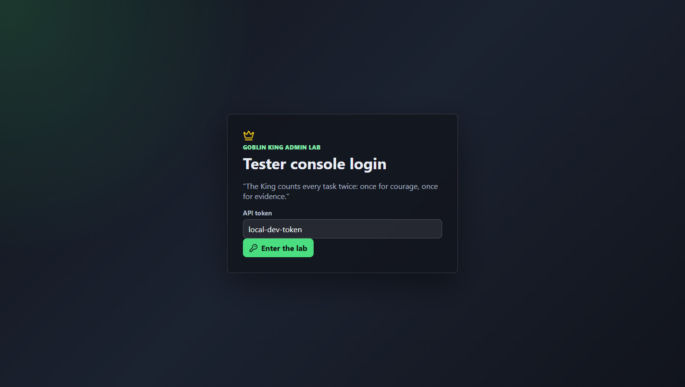
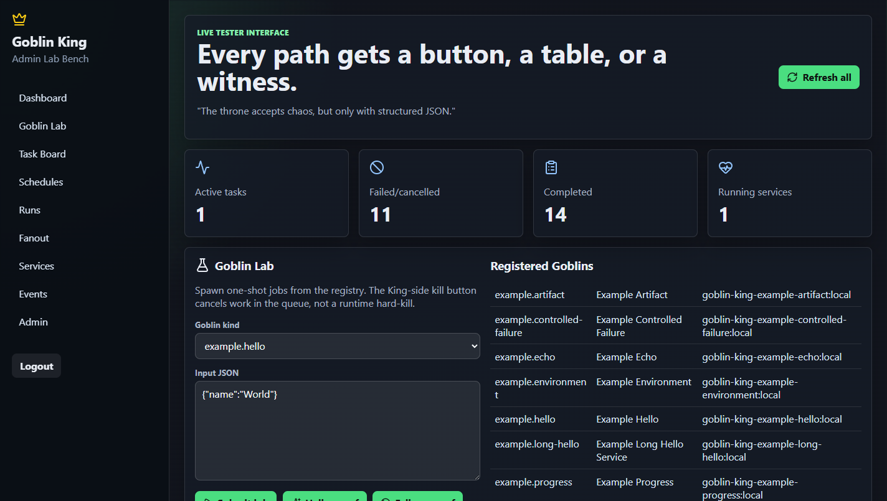
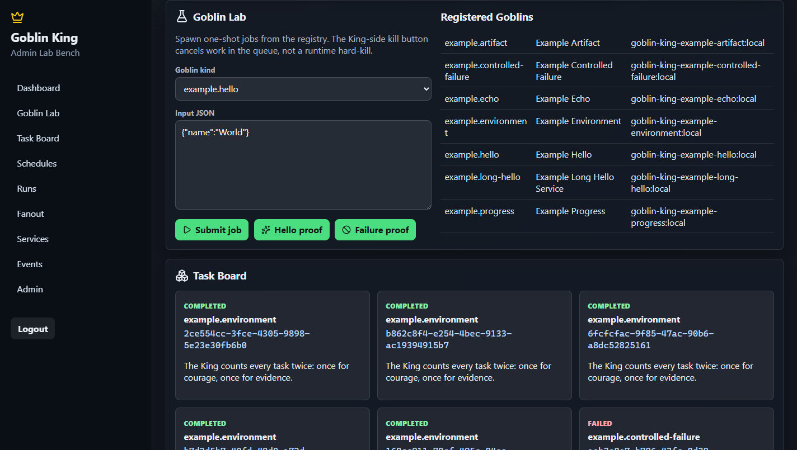
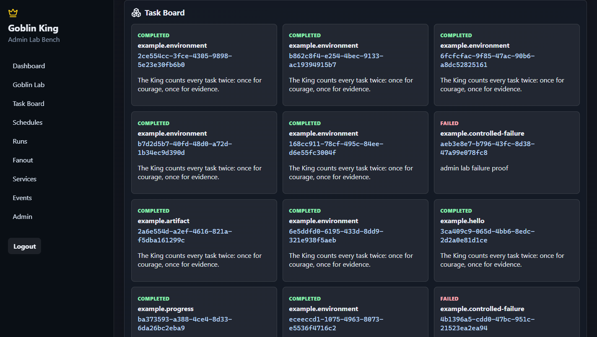
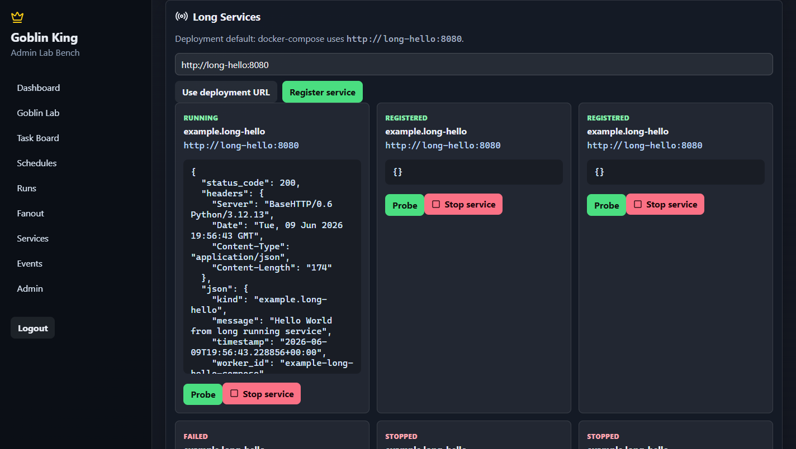
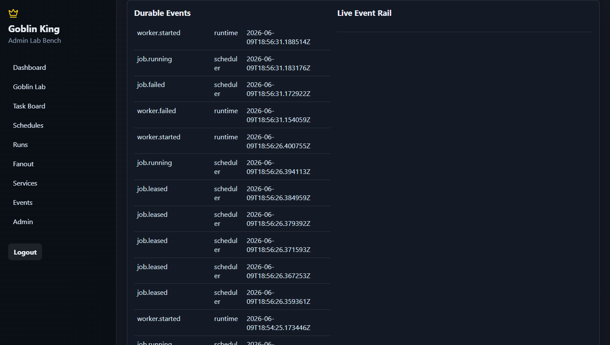
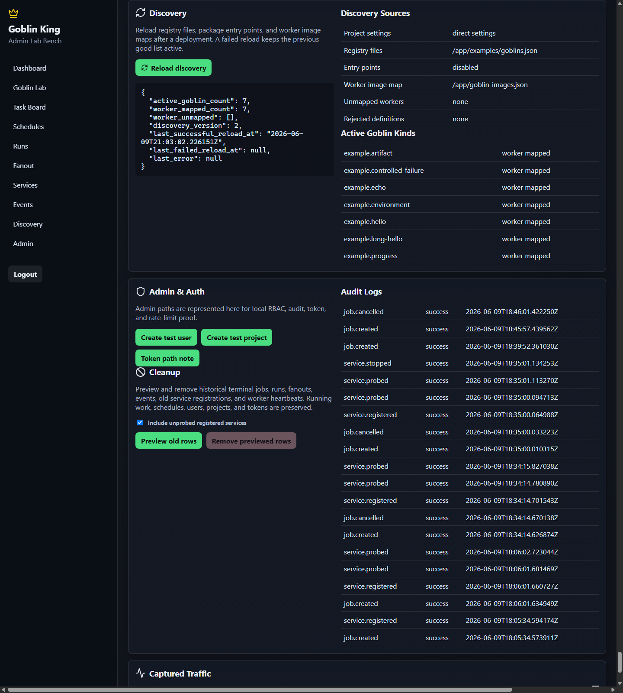
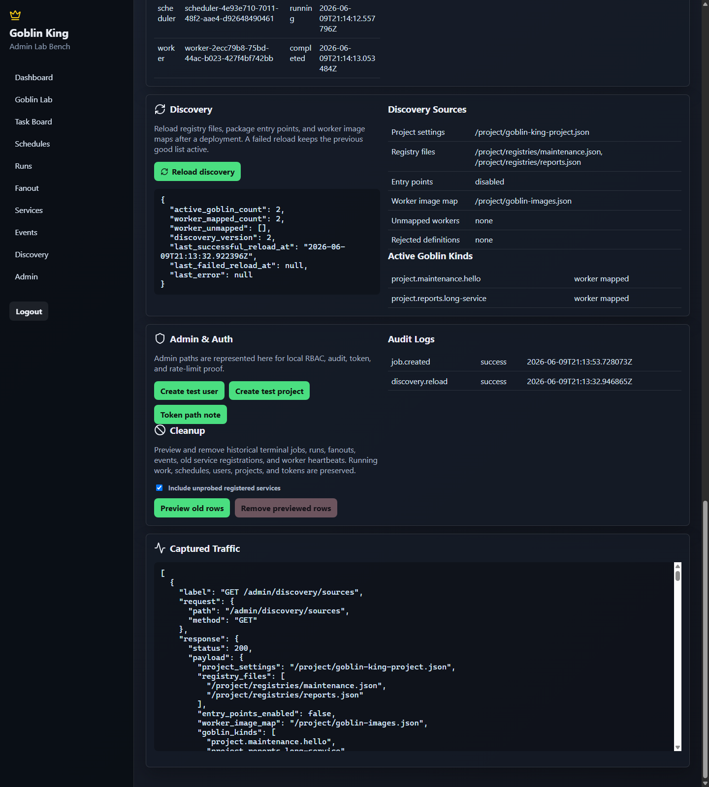
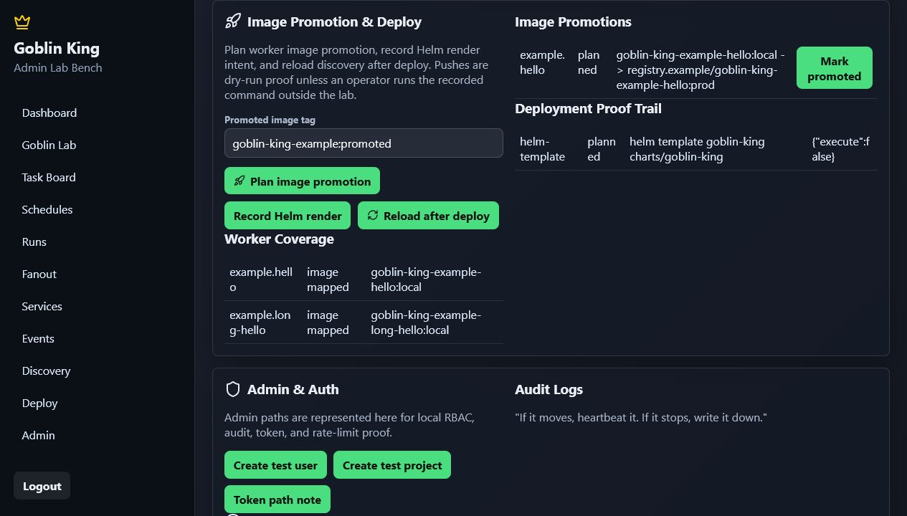
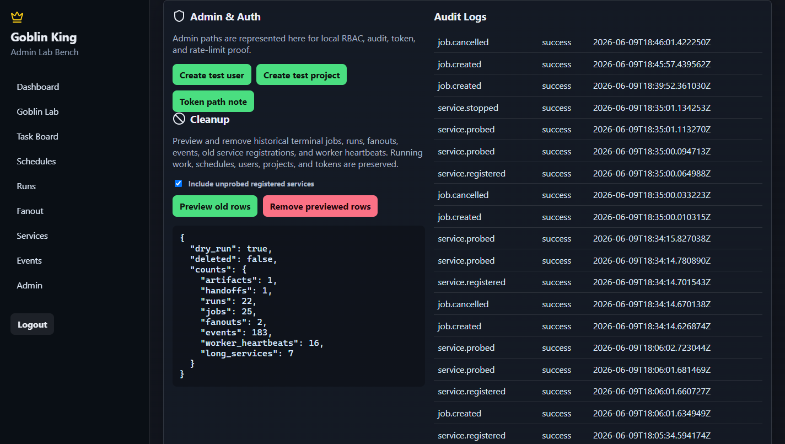

# Goblin King Admin Guide

The React admin is the operator lab bench for proving goblins work. It runs as the
same UI in Docker Compose and Helm: Docker serves it at `http://127.0.0.1:8080/admin`,
and the local Helm chart serves it at `http://goblin-king.local/admin`.

## Sign In

Use an API bearer token to enter the admin. For local development, the default token is
`local-dev-token`.

## Read The Dashboard

The dashboard gives a quick health read: active tasks, failed or cancelled tasks,
completed tasks, running long services, and the registered goblin list. Use **Refresh
all** after external CLI or scheduler actions.

## Spawn A Goblin

Use **Goblin Lab** to submit one-shot jobs. Pick a goblin kind, edit the JSON input,
and press **Submit job**. The quick buttons run common proof paths:

- **Hello proof** submits the short `example.hello` worker.
- **Failure proof** submits the controlled failure sample.
- **Progress proof** submits the heartbeat/progress sample.

The captured traffic panel records the request and response so the proof is visible in
the UI.

The default demo registry includes the core samples plus explicit language goblins for
.NET, Go, Java, Node.js, PHP, Python, Ruby, Rust, shell, C/WASI, and Rust/WASI. Search
the dropdown for `hello-go`, `hello-rust`, `hello-node`, or `wasi` when you want to
prove one runtime at a time.

## Watch And Cancel Tasks

The **Task Board** shows queued, running, retrying, completed, failed, timed-out, and
cancelled work. The **Kill / cancel** control is King-side cancellation: it cancels
queued or cancellable jobs through the API. It does not hard-kill Docker containers or
Kubernetes pods.

## Probe Long Services

Use **Services** for long-running goblins. Register the deployment URL, then press
**Probe** to call the service through the King. The `example.long-hello` service returns
`Hello World from long running service` with a fresh timestamp on every probe.

Use **Stop service** to mark a registered long-running service as stopped. Like job
cancel, this is King-side state control rather than hard runtime termination.
Use **Hard kill runtime** or **Hard stop runtime** only when testing the scoped
termination path. These admin controls target Goblin-labeled Docker containers or
Kubernetes Jobs; registered service hard-stop changes King-side service state because
the service was registered by URL.

## Inspect Events And Heartbeats

The **Events** panel shows durable SQLite-backed event history, Redis Stream delivery
health, and the live WebSocket event rail. Heartbeats appear below this section and
prove scheduler and worker liveness. If a goblin moves, the King writes it down.

## Manage Artifact Storage

The **Runs & Artifacts** panel shows the configured artifact root for Docker volumes or
the Helm PVC, whether it exists and is writable, the number of files, total bytes, and
artifact metadata rows. Use **Preview artifact cleanup** before deleting files. Cleanup
removes only files resolved under the configured artifact root. The King is fussy about
treasure rooms: if the path points outside the vault, it does not get a key.

## Reload Discovery

Use **Discovery** after deploying a new project plugin package, registry file, or worker
image map. Press **Reload discovery** to refresh the API-visible goblin list without
rebuilding the React admin. The panel shows:

- Active goblin count and discovery version.
- Last successful and failed reload timestamps.
- Registry files and whether entry-point discovery is enabled.
- Worker image-map coverage and unmapped goblin kinds.
- Rejected definitions and duplicate kind errors.

If reload fails, the previous valid goblin list stays active and the error is displayed
for proof. The King is fond of new goblins, but not fond enough to forget the last
working court.

For host-project deployments, this is the final proof step after building project worker
images and applying the Docker Compose extension or Helm values. The new project goblin
kinds should appear in **Active Goblin Kinds** after reload.

The included host-project fixture shows project registry sources and project goblin
kinds after reload:

For a complete adopter stack flow that starts Compose, mounts project config, validates
project goblins, submits a CLI job, and inspects the result in admin, see
[Adopter Admin Dev/Test Stack](adopter-admin-dev-stack.md).

## Run The Full Runtime Audit

Before roadmap PRs, run the full Docker and Helm admin runtime audit described in
[Admin Runtime Audit](admin-runtime-audit.md). The audit uses the browser to spawn every
registered goblin kind from both admin consoles, captures screenshots, and records the
job/run IDs needed in the PR body.

## Promote Images And Record Deployments

Use **Image Promotion & Deploy** to create a cloud-neutral proof trail for releases.
The panel shows worker image coverage, plans image promotion, records Helm render
intent, reloads discovery after deployment, and lists prior promotion/deployment
records.

The admin promotion button records the source worker image, target promoted tag, worker
build context, Dockerfile, and dry-run build/push commands. It does not push to a real
registry by itself. Mark a promotion as promoted after the external registry step is
complete.

Use **Record Helm render** to record the Helm template command that should be used for
deployment proof. Use **Reload after deploy** after applying Docker Compose changes or a
Helm upgrade so newly deployed goblins appear in the admin without a React rebuild.

The King allows many banners in the courtyard, but every banner needs a receipt.

## Clean Up Old Rows

Use **Admin & Auth -> Cleanup** after a test pass. Always press **Preview old rows**
first. The preview shows exactly what will be removed.

Cleanup can remove:

- Terminal jobs and runs.
- Completed fanouts.
- Captured events.
- Worker heartbeats.
- Stopped long-service rows.
- Optional unprobed registered long-service rows.

Cleanup preserves:

- Schedules.
- Users, projects, API tokens, and auth data.
- Active jobs.
- Running services.
- Scheduler heartbeat.

Press **Remove previewed rows** only after the counts look right.

## Docker And Helm Notes

Docker Compose and Helm use the same React build and the same API paths:

- UI: `/admin`
- API proxy: `/admin-api/*`
- WebSocket proxy: `/admin-ws/runs`

For local Helm, make sure `goblin-king.local` points to the local ingress controller.
The README has the current Windows hosts-file note and ingress defaults.
