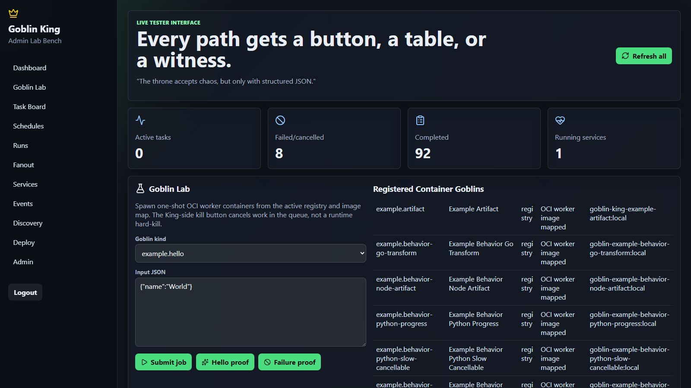
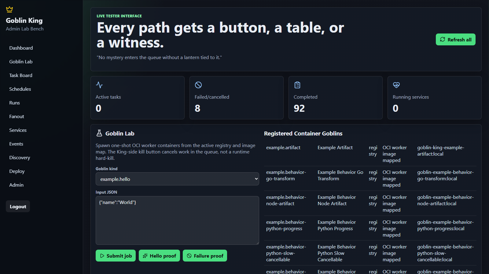

# Adopter Guide

This guide is the shortest complete path for using Goblin King inside another
project. It assumes the host project wants to define its own contract-compliant
container goblins, validate them locally, run them through Docker, and later mount the
same project config into Helm.

Goblins are containers. Python imports and entry points are optional helper surfaces for
metadata and tests; they are not required for a deployed worker.

If the host project keeps Goblin King under `vendor/goblin-king`, use the same project
config and CLI workflow described here. See
[Using Goblin King From A Vendored Checkout](using-goblin-king-from-a-vendored-checkout.md)
for submodule, subtree, and local path dependency options.

## What You Build

An adopting project owns:

- `goblin-king-project.json`: versioned project config.
- `goblin-images.json`: optional shared worker image map.
- `workers/<kind>/Dockerfile`: one self-contained worker folder per goblin.
- `inputs/*.json`: sample payloads for validation and proof.
- `schemas/*.schema.json`: optional input shape documentation.

Goblin King owns API, scheduler, Redis, admin, SQLite, events, audits, artifact
tracking, Docker/Kubernetes runtimes, and admin discovery.

## Create A Project

```bash
goblin-king project init ./my-goblin-project --prefix myproject
cd ./my-goblin-project
```

Expected files:

```text
goblin-king-project.json
goblin-images.json
goblin-king-api.json
inputs/hello.json
inputs/artifact.json
schemas/hello.input.schema.json
schemas/artifact.input.schema.json
workers/myproject.hello/Dockerfile
workers/myproject.artifact/Dockerfile
```

## Define A Goblin

Add or edit entries under `goblins`:

```json
{
  "apiVersion": "goblin-king/v1alpha1",
  "kind": "GoblinProject",
  "defaults": {
    "resources": {
      "timeout_seconds": 60,
      "memory": {"limit": "256Mi"},
      "filesystem": {"read_only_root": true},
      "network": {"mode": "none"}
    }
  },
  "goblins": {
    "myproject.hello": {
      "image": "myproject-hello:local",
      "context": "workers/myproject.hello",
      "dockerfile": "Dockerfile",
      "description": "Short hello worker",
      "inputSchema": "schemas/hello.input.schema.json",
      "resources": {
        "timeout_seconds": 30,
        "logs": {"max_bytes": 1048576}
      },
      "labels": {"team": "local"},
      "tags": ["quickstart"]
    }
  }
}
```

The worker container must read `GOBLIN_INPUT_PATH` and `GOBLIN_CONTEXT_PATH`, write a
result envelope to `GOBLIN_RESULT_PATH`, and write artifacts only under
`GOBLIN_ARTIFACT_ROOT`.

`defaults.resources` is the project-wide baseline for inline goblins. Goblin King
deep-merges it into each goblin's `resources` during project loading, so the example
above keeps the default memory cap, read-only root, and network-disabled mode while
overriding the hello timeout and adding a log ceiling. If a sibling
`goblin-resource-policies.json` defines ceilings, `project validate` checks the default
and merged per-goblin resources against those ceilings.

## Validate

Validate config and discovery:

```bash
goblin-king project validate --project goblin-king-project.json
goblin-king project goblins list --project goblin-king-project.json
```

Expected output includes project goblin kinds, such as `myproject.hello`. When
`defaults.resources` is present, `project validate` also prints that block so the shared
project resource baseline is visible in local proof output.

Validate a worker image by building and running it against temporary contract mounts:

```bash
goblin-king workers validate \
  --project goblin-king-project.json \
  --input inputs/hello.json \
  --kind myproject.hello \
  --build \
  --require-success
```

Expected output:

```text
myproject.hello ok success context,dockerfile,build,result-file,result-envelope,metrics,artifacts
```

Confirm the persisted validation proof before scheduling:

```bash
goblin-king workers validation-status --kind myproject.hello
```

Re-run validation whenever the worker image digest changes. By default, Goblin King does
not schedule project goblins whose resolved image digest has not passed the container
contract validator for the declared contract version.

The full scheduler gate, proof lifecycle, stale-digest behavior, and failure mapping
live in [Goblin Contract Validation](goblin-contract-validation.md). Keep the adoption
loop simple: validate first, then schedule.

Inspect resource-policy resolution when you need deployment proof:

```bash
goblin-king resource-policies inspect myproject.hello \
  --policies goblin-resource-policies.json
```

The effective policy is resolved from operator defaults, project `defaults.resources`,
and the goblin's own `resources` override. Jobs and runs persist that effective policy,
and workers receive it as `GOBLIN_EFFECTIVE_RESOURCE_POLICY_JSON`.

## Run Through Docker

Submit one project goblin through Docker:

```bash
goblin-king jobs submit myproject.hello \
  --project goblin-king-project.json \
  --input inputs/hello.json \
  --runtime docker
```

Inspect the run and source metadata:

```bash
goblin-king runs show <run-id> --with-job
```

Expected proof:

- `status` is `completed`.
- `result_json.status` is `success`.
- `goblin_source` is `project-config`.
- `goblin_definition.kind` is the project goblin kind.

For artifact-producing goblins, submit the artifact worker and inspect the same run
detail. Artifact metadata appears in the result envelope.

## Schedule Work

Create a due schedule and run one scheduler pass:

```bash
goblin-king schedules add myproject.hello \
  --project goblin-king-project.json \
  --input inputs/hello.json \
  --cron "* * * * *" \
  --due-now

goblin-king scheduler run-once \
  --project goblin-king-project.json \
  --runtime docker
```

Use `goblin-king jobs list` and `goblin-king runs show <run-id> --with-job` to inspect
the completed work.

## Run With Compose

For the bundled fixture, use:

```bash
docker compose \
  -f docker-compose.yml \
  -f examples/adopting-project/docker-compose.host-project.yml \
  --profile api \
  --profile admin \
  --profile project-workers \
  up -d --build redis api admin long-hello worker-project-maintenance-hello
```

Then open the admin at `http://127.0.0.1:8080/admin`, log in with
`local-dev-token`, open **Discovery**, and reload. Project goblins should appear in
Goblin Lab without a frontend rebuild.



## Run With Helm

Render the host-project values:

```bash
helm template goblin-king charts/goblin-king -f examples/adopting-project/helm-values.yaml
```

In a local Kubernetes environment:

```bash
helm upgrade --install goblin-king charts/goblin-king \
  -f examples/adopting-project/helm-values.yaml \
  --wait --timeout 5m
```

Open `http://goblin-king.local/admin`, reload Discovery, and submit the project goblin.
If the ingress host is not resolving, add this hosts-file entry:

```text
127.0.0.1 goblin-king.local
```



## Inspect Results And Artifacts

Use the admin **Runs & Artifacts** panel or CLI:

```bash
goblin-king runs show <run-id> --with-job
```

Artifact-producing goblins should return relative artifact metadata. Downloads must
resolve under the configured artifact root.

## Handle Failures

Controlled failures are valid proof when the result envelope is readable:

```json
{
  "status": "failed",
  "data": {},
  "artifacts": [],
  "metrics": {},
  "handoff": [],
  "error": "explain the failure"
}
```

Use the admin task board, events rail, audit log, and run detail to confirm whether a
failure was expected or needs fixing.

## Public Boundaries

Stable-enough internal-adopter surfaces:

- Container contract: `docs/goblin-container-contract.md`.
- Project config: `docs/project-goblin-config.md`.
- Public Python imports: `docs/PUBLIC_API.md`.
- Compatibility versions: `docs/COMPATIBILITY.md`.

Do not build host-project code against `goblin_king.runtime`, `goblin_king.store`,
or other non-root internals unless the needed behavior is promoted to the public
boundary first.

## One-Command Smoke

Run the complete local adopter proof:

```bash
goblin-king smoke adopter-project
```

The command generates a temporary adopter project, adds hello, artifact, and
controlled-failure goblins, validates their worker images, schedules them through
Docker, inspects success/artifact/failure results, and deletes the generated project
after proof. Pass `--keep` to keep the generated files for debugging.
